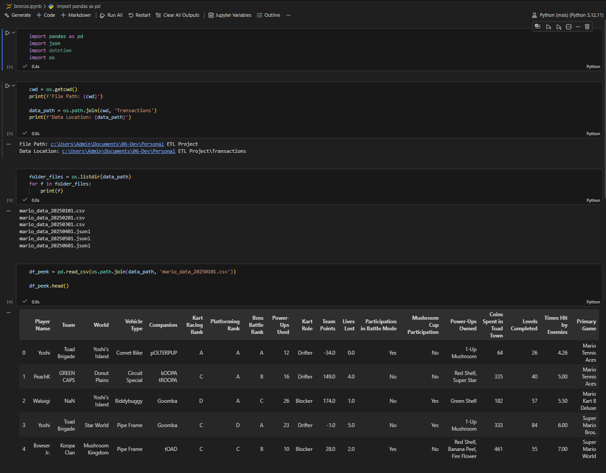
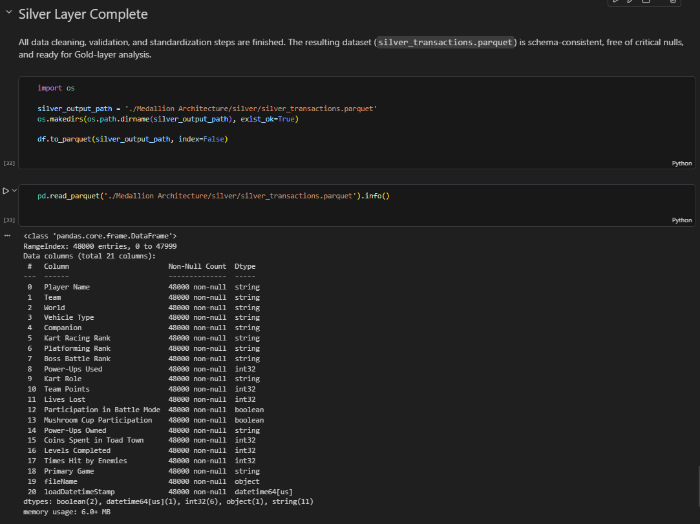
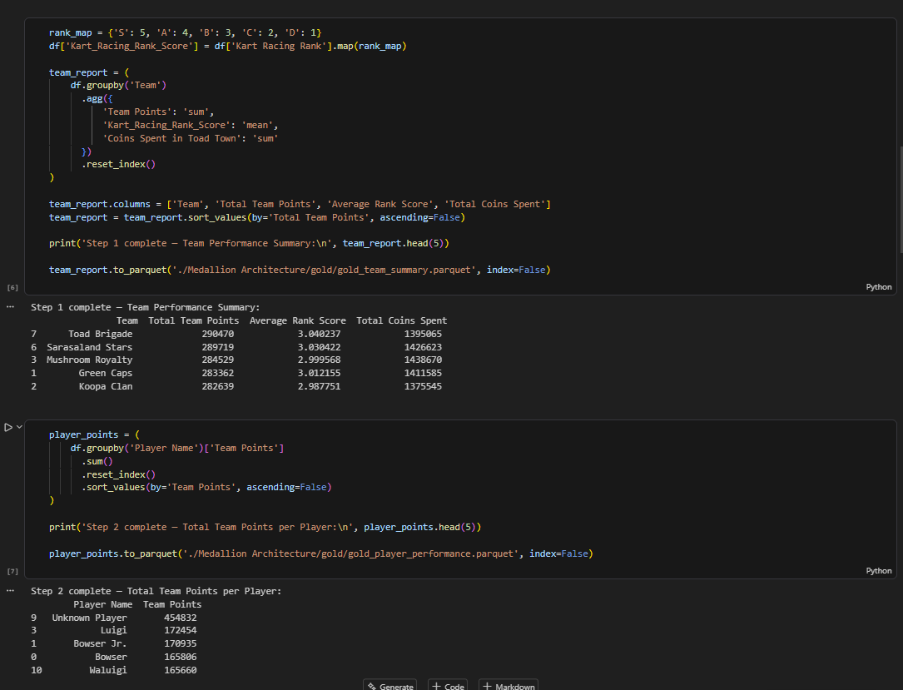

# Medallion ETL Pipeline

An end-to-end ETL project built in Python and pandas using a Bronze, Silver, and Gold medallion architecture. The pipeline ingests mixed-format raw data, standardizes inconsistent records, and produces analytics-ready summary tables for reporting.

This project is designed to showcase practical data engineering skills: layered pipeline design, schema-flexible ingestion, data cleaning, type normalization, parquet-based outputs, and reproducible project packaging for GitHub.

## Why This Project Stands Out

- Processes `48,000` records across `6` raw source files.
- Handles mixed input formats: CSV and JSON-based transaction files.
- Uses a medallion architecture to separate ingestion, cleaning, and analytics logic.
- Preserves evolving source structure in Bronze and standardizes schema in Silver.
- Produces business-facing Gold-layer outputs that are ready for dashboards or reporting.

## Business Goal

The goal of this project is to turn messy, inconsistent raw transaction data into trusted, analysis-ready datasets. Instead of stopping at basic cleaning, the pipeline creates layered outputs that mirror how modern analytics engineering and data platform teams structure ETL workflows.

## Pipeline Overview

### Bronze Layer

The Bronze layer ingests raw source files and preserves traceability.

- combines monthly source files into a single dataset
- supports both CSV and JSON-based input structures
- keeps a flexible schema to accommodate changing source columns
- appends metadata such as source file name and load timestamp
- writes a consolidated parquet output

### Silver Layer

The Silver layer improves data quality and standardization.

- fills missing values for key business fields
- converts columns into consistent string, integer, and boolean types
- removes punctuation and text noise from categorical values
- trims and normalizes casing across dimensions
- standardizes noisy player-name variations into clean canonical values

### Gold Layer

The Gold layer creates analytics-ready reporting tables.

- team performance summary
- player performance summary
- power-up usage by player
- world difficulty summary
- top player per team
- vehicle popularity report
- risk assessment by lives lost

## Example Results

From the current pipeline output:

- `Toad Brigade` leads total team points with `290,470`.
- `Luigi` is among the top named players by total team points with `172,454`.
- `Scooter` is the most frequently used vehicle type.
- `Donut Plains` has the highest average lives lost in the world difficulty report.

## Screenshots


*Bronze layer ingesting mixed CSV and JSON-based source files into a unified raw dataset with load metadata.*


*Silver layer completion showing the cleaned parquet output and a schema-consistent dataset with standardized types and no critical nulls.*


*Gold layer generating analytics-ready performance summaries, including team-level and player-level reporting outputs.*

## Tech Stack

- Python
- pandas
- Jupyter Notebook
- pyarrow
- Parquet
- Conda

## Repository Structure

```text
.
|-- Transactions/
|-- assets/
|-- Medallion Architecture/
|   |-- bronze/
|   |-- silver/
|   `-- gold/
|-- bronze.ipynb
|-- silver.ipynb
|-- gold.ipynb
|-- environment.yml
|-- PROJECT_SUMMARY.md
`-- README.md
```

## Running The Project

1. Create the environment:

```bash
conda env create -f environment.yml
conda activate medallion-etl
```

2. Launch Jupyter:

```bash
jupyter notebook
```

3. Run the notebooks in order:

```text
bronze.ipynb -> silver.ipynb -> gold.ipynb
```

## What To Include On GitHub

Recommended to keep:

- `bronze.ipynb`
- `silver.ipynb`
- `gold.ipynb`
- `Transactions/`
- `assets/`
- `README.md`
- `PROJECT_SUMMARY.md`
- `environment.yml`

Recommended to exclude:

- `.ipynb_checkpoints/`
- generated parquet files in `Medallion Architecture/`
- temporary notebook artifacts

## Portfolio Summary

This project demonstrates how to design an ETL pipeline that goes beyond notebook-based analysis and moves toward a more realistic analytics engineering workflow. It highlights data ingestion, data quality improvement, dimensional standardization, and generation of reusable outputs for downstream reporting.

## Next Improvements

- refactor notebook logic into reusable Python modules
- add automated data quality tests
- add charts or dashboard screenshots for the Gold layer
- add CI to validate the pipeline automatically
>>>>>>> 7fd5cd3 (Add ETL pipeline project)
